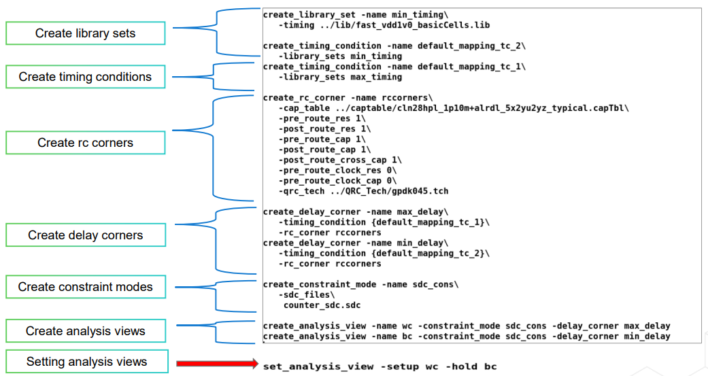
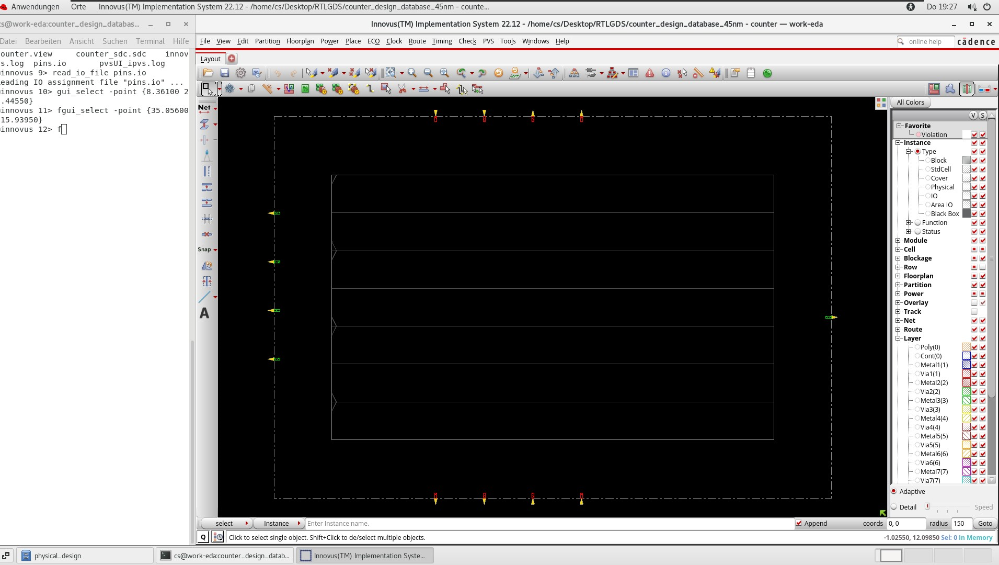
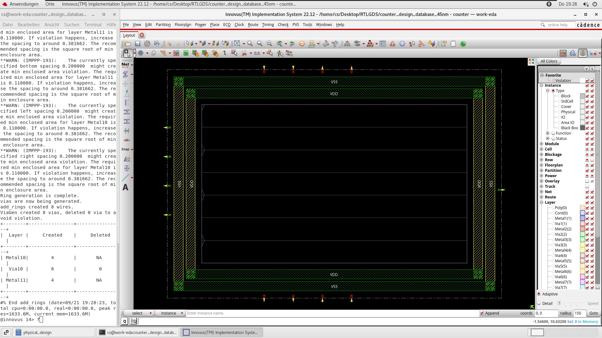
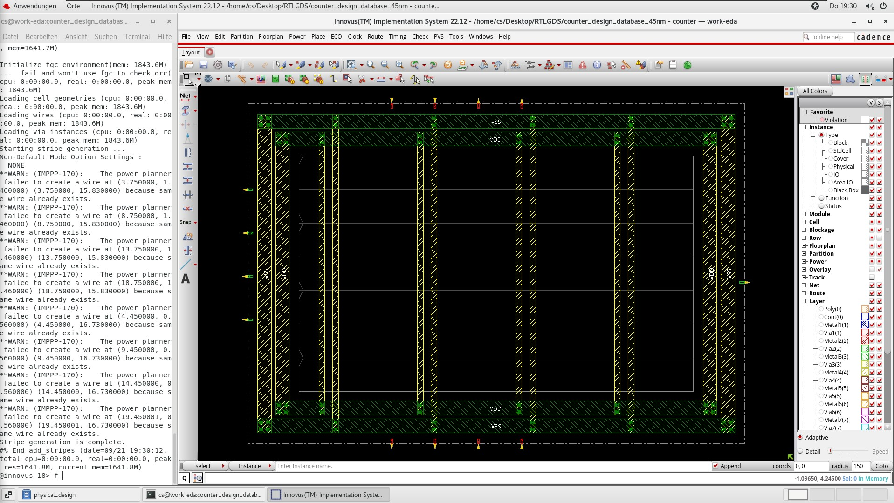
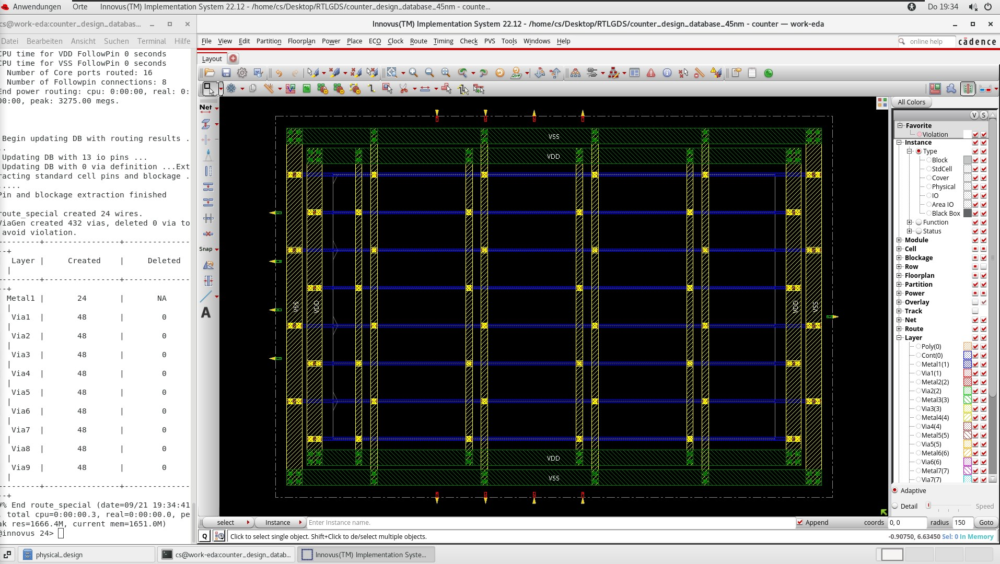

# RTL-GDS Implementation of Counter Netlist

RTL coding is a way of converting design specification into set of high-level design using Hardware Description language called verilog.

In this repo you can find detailed explanantion of how to perform RTL-GDS flow of a simple Counter netlist including the details of Cadence tools used.

>


<h2>Design Specification, Simulation and  Verification</h2>


<u><b><h4>counter.v</h4></u></b>


>
```verilog
module counter(clk,rst,count);
input clk,rst;
output reg [7:0] count;
always@(posedge clk or negedge rst)
begin
if(!rst)
count=0;
else
count=count+1;
end
endmodule
```


<u><b><h4>counter_test.v</h4></u></b>


>
```verilog
module counter_test;
reg clk, rst;
wire [7:0] count;
initial
begin
clk=0;
rst=0;#10;
rst=1;
end
counter counter1(clk,rst, count);
always #5 clk=~clk;
endmodule
```

<h2> Functional Simulation</h2>

The first step- Design specification and RTL coding invloves conversion of design specification into code using verilog HDL. The design is further verified using HDLs like System Verilog, Verilog or VHDL considering various parameters such as code coverage, Block coverage, expression coverage, FSM coverage  and assertion coverage. Verification is one of the most tedious process into which most effort is put. There are various kinds of verification such as functional verification, formal verification. Functional simulation makes sure that the intended code works as expected whereas formal verification utilize mathematical concepts to verify the design.

Cadence tool Xcelium Simulator is used to perform functional simulation of the deisgn as it supports various languages such as verilog, systemVerilog, verilogA etc.


>.png>)


>.png>)


<h2> Logical and Physical Synthesis</h2>

Synthesis involves compilation, elaboration and simulation of the high-level design to obtain gate-level netlist. This step translates the high level coding constructs such as if-else-if, while and others into simple logical elements such as universal gates(AND, NAND, NOR), multiplexes, decoders and flipflops.
This step where generic netlists are generated is called as translation and these generic boolean expressions are further mapped/optimised to technology specific gates. 


<b>Inputs required for the synthesis process are the design sile and the design constraints havin all the details of clock i.e setup time, hold time, transition times(rise and fall).</b>

<b><u><h4>counter_constraints.sdc</h4></u></b>

>
```sdc
create_clock -name clk -period 1 -waveform {0 0.5} [get_ports "clk"]
set_clock_transition -rise 0.05 [get_clocks "clk"]
set_clock_transition -fall 0.05 [get_clocks "clk"]
set_clock_uncertainty 0.01 [get_ports "clk"]
set_input_delay -max 0.05 [get_ports "rst"] -clock [get_clocks "clk"] 
#max indicates that the number applies for setup analysis. Min--> hold analysis
set_output_delay -max 0.05 [get_ports "count"] -clock [get_clocks "clk"]
```

The below TCL script depicts the steps of synthesis where the design file is complied and elaborated to obtain the gate-level netlist file.


The TCL tool commnad language is used to have a  seamless communication between various EDA tools.

>
```TCL

#reading the synopsys design constraints file which contains infomration of clock, setup and hold time decided for the design.

#Step 1: Set the library paths

set_db init_lib_search_path <Absolute_path_to_the_technology_file>
set_db init_hdl_search_path <Absolute_path_to_the_design_file>
read_libs <Name_of_the_technology_file>


#Step 2: Read netlist
read_hdl counter.v

#Step 3: Elaborate and connect all modules
elaborate

#reading the synopsys design constraints file which contains infomration of clock, setup and hold time decided for the design.
#Step 4: Read constraints
read_sdc ../constraints/constraints_top.sdc


#setting the efforts level of all the steps to medium
set_db syn_generic_effort medium
set_db syn_map_effort medium
set_db syn_opt_effort medium

syn_generic

#reporting the timing, power, area of the generic netlist
report_timing > reports/genreic/report_timing.rpt
report_power  > reports/generic/report_power.rpt
report_area   > reports/generic/report_area.rpt
report_qor    > reports/generic/report_qor.rpt

#Maps  the  design  to  the  cells  described in the supplied technology library and performs logic optimization.
syn_map

#reporting the timing, power, area of the technology mapped netlist before optimisation
report_timing > reports/mapped/report_timing.rpt
report_power  > reports/mapped/report_power.rpt
report_area   > reports/mapped/report_area.rpt
report_qor    > reports/mapped/report_qor.rpt

#Check design for timing errors
check_design > design_check.txt

syn_opt

#reporting the timing, power, area of the optimised netlist
report_timing > reports/optimised/report_timing.rpt
report_power  > reports/optimised/report_power.rpt
report_area   > reports/optimised/report_area.rpt
report_qor    > reports/optimised/report_qor.rpt


#Write out synthesised netlist and constraints which serves as input during PnR flow.

write_hdl > outputs/counter_netlist.v
write_sdc > outputs/counter_sdc.sdc
write_sdf -timescale ns -nonegchecks -recrem split -edges check_edge  -setuphold split > outputs/delays.sdf

```


>.png>)
In the above image we can see the counter being synthesised into its corresponding flipflops and universal gates.


<h2> Digital Implementation using Innovus</h2>

<h4>The following steps are performed in the Digital Implementation stage</h4>

> 
● Floorplanning\
● Powerplanning- Vdd, Vss\
● Pin placement\
● Placement of cells\
● Pre-CTS timing\
● Clock tree synthesis (CTS)\
● Post-CTS timing\
● Routing and report timing \
● DRC and LVS checks\
● Extract RC, streamout layout

<h4> Floorplanning </h4>

Floorplanning is the process of deriving the die size, allocating space for soft blocks, 
planning power, and macro placement.


>
above 

>
```tcl

create_library_set -name max_timing\
   -timing ../lib/slow_vdd1v0_basicCells.lib

create_library_set -name min_timing\
   -timing ../lib/fast_vdd1v0_basicCells.lib

create_timing_condition -name default_mapping_tc_2\
   -library_sets min_timing
create_timing_condition -name default_mapping_tc_1\
   -library_sets max_timing

create_rc_corner -name rccorners\
   -cap_table ../captable/cln28hpl_1p10m+alrdl_5x2yu2yz_typical.capTbl\
   -pre_route_res 1\
   -post_route_res 1\
   -pre_route_cap 1\
   -post_route_cap 1\
   -post_route_cross_cap 1\
   -pre_route_clock_res 0\
   -pre_route_clock_cap 0\
   -qrc_tech ../QRC_Tech/gpdk045.tch

create_delay_corner -name max_delay\
   -timing_condition {default_mapping_tc_1}\
   -rc_corner rccorners
create_delay_corner -name min_delay\
   -timing_condition {default_mapping_tc_2}\
   -rc_corner rccorners

create_constraint_mode -name sdc_cons\
   -sdc_files\
    counter_sdc.sdc 

create_analysis_view -name wc -constraint_mode sdc_cons -delay_corner max_delay
create_analysis_view -name bc -constraint_mode sdc_cons -delay_corner min_delay

set_analysis_view -setup wc -hold bc

```




The above image shows the analysis view where the delay corners, constraint mode, RC corners and timing condition are set during floorplanning.

> <h3> Power Rings</h3>



<h3> Power Routing </h3>
Power routing is the process of connecting the local power routes to the global power that were created during an earlier step of power planning. 

> <h3> Power Stripes</h3>



> <h3> Power Rails</h3>



> <h2> Placement</h2>
Placement is the process of placing the standard cells and blocks in a floorplanned design.

Optimization is the process of iterating through a design such that it meets timing, area, and power specifications.


>In general, optimization can be broken down into the following areas:
▪ Timing\
▪ Signal integrity\
▪ Power\
▪ Area

>Depending on the stage of the design, optimization can include the following operations:
● Adding buffers\
● Resizing gates\
● Restructuring the netlist\
● Remapping logic\
● Swapping pins\
● Deleting buffers\
● Moving instances\
● Applying useful skew\
● Layer optimization\
● Track optimization


<h2> Clock Tree Synthesis </h2>


Clock Tree Synthesis is the process of inserting buffers in the clock path, with the goal of minimizing clock skew and latency to optimize timing.

<h2> Routing</h2>

Detail routing is the process of connecting the cells and macros in the design on metal layers specified in the technology LEF file that is generally provided by the foundry so that the routes are DRC correct and timing and signal-integrity aware.